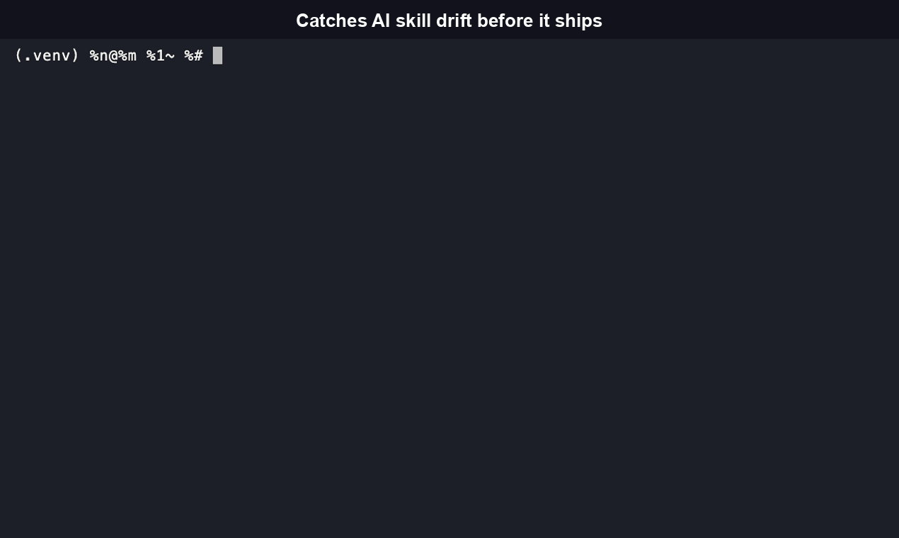
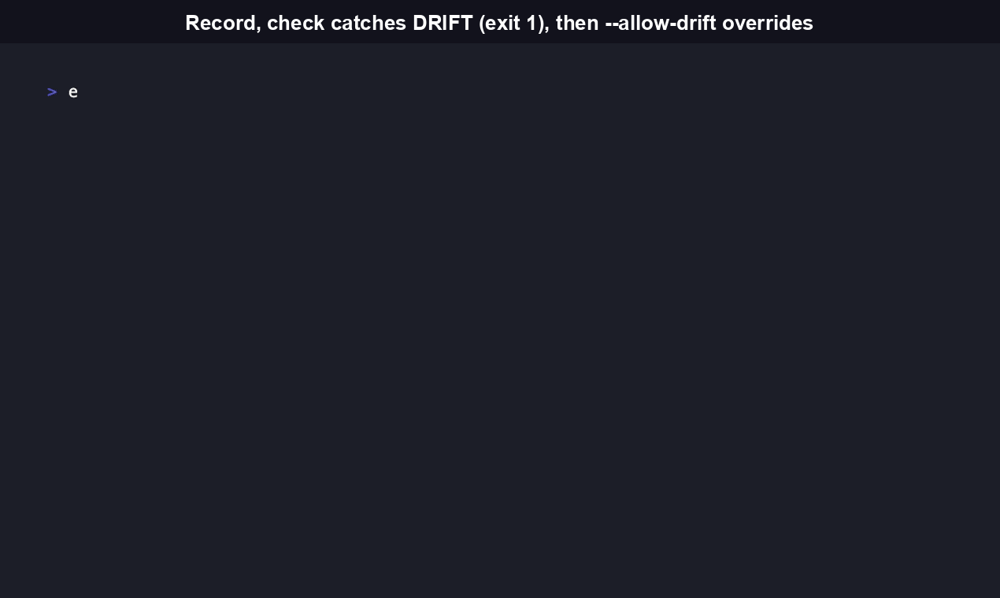

# evolveguard

[](https://github.com/RudrenduPaul/evolveguard/actions/workflows/ci.yml)
[](https://www.npmjs.com/package/evolveguard-cli)
[](https://pypi.org/project/evolveguard-cli/)
[](LICENSE)
[](package.json)
[](https://pypi.org/project/evolveguard-cli/)

<p align="center">
<a href="#what-it-does">What it does</a> •
<a href="#quickstart">Quickstart</a> •
<a href="#cli-command-reference">CLI reference</a> •
<a href="#agent-native-usage">Agent-native usage</a> •
<a href="#how-it-compares">How it compares</a> •
<a href="#faq">FAQ</a>
</p>

Catch behavioral drift when a Claude Agent Skill or a Claude Code `MEMORY.md` file edits itself, before the edit ships.



```bash
# PyPI -- Python CLI + library (genuine port, not a Node wrapper)
pip install evolveguard-cli
```

```bash
# npm -- JavaScript/TypeScript CLI + library
npm install -g evolveguard-cli
```

> [!NOTE]
> Both packages are live and named consistently: `evolveguard-cli` on PyPI and
> `evolveguard-cli` on npm (renamed 2026-07-19 from the old plain `evolveguard`,
> which is now deprecated on both registries). `npm install -g evolveguard-cli` and
> `pip install evolveguard-cli` both work today; the demo GIFs below were recorded
> against the published packages, not a local build.

## What it does

```bash
evolveguard record ./SKILL.md --fixtures ./fixtures.json
# ... skill gets edited, by a human or an agent ...
evolveguard check ./SKILL.md
```

```
EvolveGuard v0.1.4 -- Regression Check
skill: monorepo-scanner  baseline: 2026-07-15  fixtures: 1

[DRIFT] fixture: "scan a monorepo"  new tool call: fs.write (baseline had none)
         -> new tool call: fs.write (baseline had none) -- this edit introduces a
            capability the baseline never used

0 PASS, 1 DRIFT, 0 FAIL
exit code 1 (DRIFT blocks merge by default; override with --allow-drift)
```

That's real output from this repo's own `fixtures/labeled-non-breaking-edits/case-03-add-write-capability/`
test case, wired to `filesystem: read-only` becoming `read-write` in the skill's frontmatter.
Reproduce it yourself: `evolveguard record` the `before/SKILL.md` in that folder against its
`fixtures.json`, then `evolveguard check` the `after/SKILL.md`.



## Features

**Static analysis, not a live agent run.** `record` parses a skill file's YAML
frontmatter (declared `tools`, `network`, `filesystem`, `scope`, and any bundled
`hooks`), scans the skill's body text and hook scripts for evidence of network calls
or filesystem writes, and combines both into a capability surface. `check` re-parses
the edited file with the same logic and diffs the result. Neither command runs
`eval`, shells out to a subprocess, or executes a skill's hook scripts, in either the
TypeScript or the Python distribution.

**Two-level diffing catches drift a single fixture can miss.** Each fixture's
`expectedToolCalls` filters the recorded capability surface down to what that fixture
cares about, but `check` also diffs the skill's _whole_ capability surface separately.
A new capability that no fixture's `expectedToolCalls` happens to cover still shows
up as a `surfaceChanges` entry instead of passing silently. Confirmed against this
repo's own `case-04-scope-widened` fixture, where a `fs.write` scope widens from
`./workspace/**` to `./**`.


**0% false positives on a labeled corpus, reproducibly.** `npx vitest run
src/evolveguard/benchmark.test.ts` runs the record/check/diff pipeline against
`fixtures/labeled-non-breaking-edits/`: 2 cases hand-labeled non-breaking (a wording
tweak, a typo fix) and 3 labeled breaking (a new write capability, a widened scope, a
hook script gaining a network call). As of this commit, both non-breaking cases stay
clean: 0 of 2 flagged as drift. The corpus is small and grows as more real skill edits
get reported.

**A path-traversal guard on hook scripts.** A skill's declared hook paths are resolved
and validated against that skill's own directory before being read, including a
symlink-escape re-check that runs after the lexical containment check passes
(`src/evolveguard/paths.ts` and `python/src/evolveguard/paths.py`).

**Every subcommand supports `--json`.** `record`, `check`, and `report` all take a
`--json` flag and return a stable `schemaVersion`-tagged structure, so a coding agent
can call any of them as a subprocess and parse the result directly.

**Two independently maintained, format-compatible distributions.** The npm package
(TypeScript, repo root) and the PyPI package (Python, `python/`) parse the same
frontmatter schema and produce byte-compatible baseline and report JSON. A baseline
recorded with one CLI can be checked with the other; see
[docs/concepts.md](./docs/concepts.md#file-formats-and-cross-distribution-compatibility)
for the file-format details.

evolveguard detects changes in what a skill is _declared or shown_ to be capable of.
It does not run a live LLM agent or replay a real conversation transcript, so it
cannot tell you whether an agent would actually behave differently on a given prompt.
That is an intentional scope limit, and also why it needs nothing hosted and runs
fully offline in a pre-commit hook or CI job.

## Quickstart

```bash
# 1. Record a baseline against a skill and its labeled fixtures
evolveguard record ./skills/my-skill/SKILL.md --fixtures ./fixtures/my-skill.json
# writes ./skills/my-skill/.evolveguard-baseline.json

# 2. Edit the skill (by hand, or let an agent edit it)

# 3. Check for drift
evolveguard check ./skills/my-skill/SKILL.md
# writes ./evolveguard-report.json, exits 1 if drift was found
```

A fixtures file is a JSON array of labeled prompts and the tool-call shapes each one is
expected to touch:

```json
[
  {
    "id": "scan-a-monorepo",
    "prompt": "scan a monorepo",
    "expectedToolCalls": [{ "tool": "fs.read" }, { "tool": "fs.write" }]
  }
]
```

`expectedToolCalls` is optional; omit it and the fixture is treated as exercising the
skill's entire capability surface. `scopeMatches` (a glob) narrows a tool to a specific
filesystem scope, e.g. `{ "tool": "fs.write", "scopeMatches": "./workspace/**" }`.

## CLI command reference

Generated from the actual `--help` output of the installed CLI (verified against both
the npm and PyPI builds; flags and defaults are identical across distributions).

<details>
<summary><code>evolveguard --help</code></summary>

```
Usage: evolveguard [options] [command]

Regression-testing CLI for self-edited Claude Agent Skills (SKILL.md,
MEMORY.md) -- golden-transcript record/replay against a skill's own declared
and inferred capability surface, zero hosted infrastructure.

Options:
  -V, --version                  output the version number
  -h, --help                     display help for command

Commands:
  record [options] <skillPath>   Record a golden-transcript baseline for a
                                 skill against a set of labeled fixtures
  check [options] <skillPath>    Replay the fixtures from a baseline against
                                 the current (possibly edited) skill and report
                                 drift
  report [options] [reportPath]  Print a previously generated
                                 evolveguard-report.json
  mcp                            [coming soon] Expose record/check/report as
                                 MCP tools for a coding agent to call
                                 mid-session
  help [command]                 display help for command
```

</details>

<details>
<summary><code>evolveguard record --help</code></summary>

```
Usage: evolveguard record [options] <skillPath>

Record a golden-transcript baseline for a skill against a set of labeled
fixtures

Arguments:
  skillPath          path to the SKILL.md or MEMORY.md file to baseline

Options:
  --fixtures <path>  path to a fixtures JSON file (array of {id, prompt,
                     expectedToolCalls?})
  --baseline <path>  path to write the baseline file (default:
                     <skill-dir>/.evolveguard-baseline.json)
  --json             output structured JSON instead of human-readable text
                     (default: false)
  -h, --help         display help for command
```

</details>

<details>
<summary><code>evolveguard check --help</code></summary>

```
Usage: evolveguard check [options] <skillPath>

Replay the fixtures from a baseline against the current (possibly edited) skill
and report drift

Arguments:
  skillPath          path to the SKILL.md or MEMORY.md file to check

Options:
  --baseline <path>  path to the baseline file (default:
                     <skill-dir>/.evolveguard-baseline.json)
  --report <path>    path to write the report file (default:
                     "./evolveguard-report.json")
  --allow-drift      exit 0 even if drift is detected (drift is still reported)
                     (default: false)
  --json             output structured JSON instead of human-readable text
                     (default: false)
  -h, --help         display help for command
```

</details>

<details>
<summary><code>evolveguard report --help</code></summary>

```
Usage: evolveguard report [options] [reportPath]

Print a previously generated evolveguard-report.json

Arguments:
  reportPath  path to the report file (default: "./evolveguard-report.json")

Options:
  --json      output structured JSON instead of human-readable text (default:
              false)
  -h, --help  display help for command
```

</details>

**Exit codes:** `0` all fixtures PASS and no surface-level drift, `1` at least one DRIFT
was found (pass `--allow-drift` to still exit 0 while still reporting it), `2` a usage
error or a file that failed to parse.

> [!WARNING]
> The npm build's `evolveguard --version` currently prints `0.1.0` even though the
> published package is at a newer `package.json` version; the PyPI build reads its version
> from installed package metadata and reports it correctly. Use the badges above, not
> `--version`, if you need the exact currently-published version number of the npm package.

## Agent-native usage

Every subcommand supports `--json` for structured output an agent can parse directly:

```bash
evolveguard check ./SKILL.md --json
```

```json
{
  "schemaVersion": 1,
  "skillName": "monorepo-scanner",
  "results": [
    {
      "id": "scan-a-monorepo",
      "verdict": "DRIFT",
      "changes": [
        /* ... */
      ]
    }
  ],
  "surfaceChanges": [],
  "summary": { "pass": 0, "drift": 1, "total": 1 },
  "exitCode": 1
}
```

> [!WARNING]
> `evolveguard mcp` is documented but not implemented yet, in either distribution. Until
> it ships, call `record`/`check`/`report --json` directly as a subprocess from your
> coding agent.

## Library API

evolveguard also exports a programmatic API for the same pipeline, for teams who want
to integrate it into their own tooling instead of shelling out to the CLI. Both
distributions expose the same functions and the same JSON-compatible file format; a
baseline recorded with one CLI can be checked with the other (see
[docs/concepts.md](./docs/concepts.md#file-formats-and-cross-distribution-compatibility)).

**TypeScript:**

```ts
import {
  recordBaseline,
  replaySkill,
  diffAll,
  writeBaseline,
  readBaseline,
} from 'evolveguard';

const baseline = recordBaseline('./SKILL.md', './fixtures.json');
writeBaseline('./.evolveguard-baseline.json', baseline);

// ... skill gets edited ...

const saved = readBaseline('./.evolveguard-baseline.json');
const replay = replaySkill('./SKILL.md', saved);
const report = diffAll(saved, replay);
```

See `src/evolveguard/index.ts` for the full exported surface: `parseSkillFile`,
`deriveCapabilitySurface`, `loadSkill`, `buildFixtureSnapshots`, `loadFixtures`,
`recordBaseline`, `replaySkill`, `diffFixture`, `diffAll`, `diffSurface`, `writeBaseline`,
`readBaseline`, `writeReport`, `readReport`, plus the shared `types.ts` interfaces.

**Python** (`pip install evolveguard-cli`):

```python
from evolveguard import record_baseline, replay_skill, diff_all, write_baseline, read_baseline

baseline = record_baseline("./SKILL.md", "./fixtures.json")
write_baseline("./.evolveguard-baseline.json", baseline)

# ... skill gets edited ...

saved = read_baseline("./.evolveguard-baseline.json")
replay = replay_skill("./SKILL.md", saved)
report = diff_all(saved, replay)
```

See [`python/README.md`](./python/README.md) for the Python-specific walkthrough and
the same exported surface under `evolveguard/__init__.py`.

## How it compares

**Braintrust** is a general LLM eval and observability platform. It is a strong choice
if you are already logging traces from a live agent and want statistical eval scoring
across runs, but it needs SDK integration and an eval-definition step per app.
evolveguard needs neither: point it at one `SKILL.md` file and a fixtures JSON, and it
works.

**[agent-eval](https://github.com/RudrenduPaul/agent-eval)** (this same author's other
repo) answers a different question: whether an agent's behavior changed between two
versions you define, for any agent, framework-agnostic, by running both versions
yourself and computing a p-value on the difference. evolveguard is triggered directly
by a file diff on `SKILL.md`/`MEMORY.md` and answers whether _this specific edit_
changed the capability surface a baseline recorded. It parses the skill artifact
itself and never asks you to define or run anything live.

|                | evolveguard                                  | Braintrust                         | agent-eval                                |
| -------------- | -------------------------------------------- | ---------------------------------- | ----------------------------------------- |
| Setup          | `record` + `check` against one file          | SDK integration, eval definitions  | Define and run two agent versions         |
| Trigger        | `SKILL.md`/`MEMORY.md` file diff             | Manual eval run                    | Manual A/B run                            |
| Mechanism      | Static capability-surface diff               | Live-run trace scoring             | Statistical behavior comparison (p-value) |
| Hosted infra   | None                                         | Hosted platform                    | None                                      |
| Live LLM calls | None                                         | Yes (scores real runs)             | Yes (runs both versions)                  |
| Best for       | Self-edited Claude Agent Skills specifically | General LLM app eval/observability | Any agent, generic A/B regression         |

## What is evolveguard, and why does it exist

evolveguard is a command-line tool and TypeScript library that detects capability drift
in Claude Agent Skill files (`SKILL.md`) and Claude Code auto-memory files (`MEMORY.md`)
after they are edited, by a human or by an agent. It works by parsing a skill's declared
frontmatter scope and any static evidence of network or filesystem-write behavior in its
body text and bundled hook scripts, snapshotting that as a baseline, and re-deriving the
same snapshot after an edit to diff against it. It exists because Claude Code's Agent
Skills ecosystem lets skills and memory files change an agent's behavior without a
human necessarily reviewing every edit for regression, and no existing tool checks that
specific artifact shape without requiring SDK integration or a live agent run.

## Status

This is a v0.1 release: a small, focused addition to the existing Claude Agent Skills
ecosystem. It ships fully MIT-licensed with no proprietary tier, as two independent,
equally first-class packages:

- **PyPI (`evolveguard-cli`, Python)**, live at
  [pypi.org/project/evolveguard-cli](https://pypi.org/project/evolveguard-cli/). A
  genuine independent port, not a wrapper around the Node binary (see
  [`python/README.md`](./python/README.md)). `pip install evolveguard-cli` installs it
  directly. The package was originally published under the name `evolveguard`; that
  older PyPI project is retired and no longer receives updates, install
  `evolveguard-cli` instead.
- **npm (`evolveguard-cli`, TypeScript)**, live at
  [npmjs.com/package/evolveguard-cli](https://www.npmjs.com/package/evolveguard-cli).
  `npm install -g evolveguard-cli` installs it directly. Renamed 2026-07-19 from the
  old plain `evolveguard`, which is now deprecated, to match the PyPI package's
  naming convention.

## FAQ

**What is evolveguard, exactly?**
A command-line tool and library that detects capability drift in Claude Agent Skill
files (`SKILL.md`) and Claude Code auto-memory files (`MEMORY.md`) after they are
edited. It is not a self-evolving agent framework and does not build, run, or host
agents itself. It is a regression-testing CI gate that reacts to a file diff on a
skill artifact that already changed, by a human or an agent. See "What is evolveguard,
and why does it exist" above for the full definition.

**Does evolveguard call an LLM?**
No. Record and check are both fully static and deterministic; see "Features" above for
exactly what each command parses and scans.

**What's the core differentiator versus a general testing or eval tool?**
It needs nothing hosted and nothing to integrate: point it at one `SKILL.md` file and a
fixtures JSON, and `record`/`check` work immediately, with zero SDK integration and no
live agent run. That is the tradeoff the "How it compares" table above documents:
narrower scope than a general eval platform, in exchange for zero setup.

**How does evolveguard compare to Braintrust?**
Braintrust is a general LLM eval and observability platform that needs SDK integration
and an eval-definition step, and it scores real traces from a live agent run.
evolveguard needs neither; it parses the skill file itself and never calls an LLM. Use
Braintrust if you are already logging traces and want statistical eval scoring across
runs. Use evolveguard if you want a pre-commit or CI check that a `SKILL.md`/`MEMORY.md`
edit did not silently widen what the skill can do. See the comparison table in "How it
compares" above for the full breakdown, including how it compares to this same author's
[agent-eval](https://github.com/RudrenduPaul/agent-eval).

**Does it work with `MEMORY.md` files, which have no frontmatter?**
Yes. A file with no frontmatter is parsed with an empty declared scope, so its capability
surface comes entirely from static evidence found in the body text.

**What platforms does it run on, and how do I install it?**
The npm package requires Node.js >=20.12 (any OS Node supports) and installs with
`npm install -g evolveguard-cli`. The PyPI package requires Python >=3.9 and installs
with `pip install evolveguard-cli`. Both distributions are pure-library/CLI packages
with no native bindings, so there is no OS-specific build step on either side.

**What's a real limitation to know about before relying on this?**
It only sees _declared or shown_ capability, not runtime behavior. A skill could pass
`check` and still behave differently on a given prompt in ways that do not touch its
capability surface. The false-positive benchmark (see "Features" above) is also
currently a small, hand-labeled corpus of 5 before/after pairs, not a large dataset, so
treat the 0% figure as a starting measurement, not a statistical guarantee. The `mcp`
subcommand is also documented but not implemented yet in either distribution, and the
npm build's `evolveguard --version` output currently lags the package's real published
version (see "CLI command reference" above).

**Is this a general agent-evolution framework?**
No. See "How it compares" above. evolveguard deliberately does not build or host a
self-evolving agent framework; it only tests skill/memory edits that already happened.

**Is evolveguard free to use, including commercially?**
Yes. It is MIT-licensed with no proprietary tier or paid version; see
[LICENSE](LICENSE). You can use, modify, and redistribute it, including in commercial
projects, under the standard MIT terms.

## Contributing

See [CONTRIBUTING.md](CONTRIBUTING.md). Every change lands with tests in both
distributions; a change to the frontmatter schema, the capability-surface derivation,
or the diff verdict logic must be made in both `src/evolveguard/` (TypeScript) and
`python/src/evolveguard/` (Python), with equivalent coverage added to both suites.

## Security

See [SECURITY.md](SECURITY.md). evolveguard reads local files you point it at and
never executes any of them; it makes no network calls and does not run a live agent.

## License

MIT. See [LICENSE](LICENSE).
